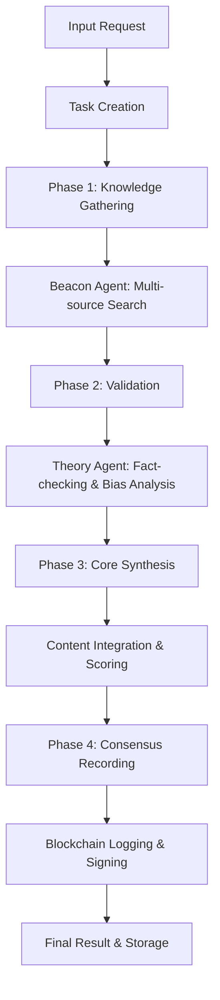

# ----------------------------------------------------------------------------
#  File:        README.md
#  Project:     Celaya Solutions (C-Suite Blockchain)
#  Created by:  Celaya Solutions, 2025
#  Author:      Christopher Celaya <chris@celayasolutions.com>
#  Description: Core Agent - Main Processor & Insight Engine
#  Version:     1.0.0
#  License:     BSL (SPDX id BUSL)
#  Last Update: (May 2025)
# ----------------------------------------------------------------------------

# ⚙️ Core Agent - Main Processor & Insight Engine

## Overview

The **Core Agent** serves as the central processing unit of the C-Suite ecosystem. It orchestrates complex tasks between multiple agents, synthesizes insights, manages consensus, and maintains overall system state with full blockchain integration. Core is the "brain" that coordinates Beacon (knowledge) and Theory (validation) to deliver comprehensive, validated insights.

## 🎯 Core Capabilities

### Insight Orchestration
- **Multi-Phase Processing**: Coordinates knowledge gathering → validation → synthesis → consensus
- **Agent Coordination**: Manages sequential and parallel task execution across agents
- **Quality Assurance**: Ensures comprehensive validation before final output

### Consensus Management
- **Multi-Agent Consensus**: Weighted, majority, and unanimous consensus algorithms
- **Confidence Scoring**: Advanced scoring based on agent reliability and agreement
- **Conflict Resolution**: Identifies and manages disagreements between agents

### Insight Synthesis
- **Content Integration**: Combines multiple agent outputs into coherent insights
- **Reliability Weighting**: Weights contributions based on agent confidence and source credibility
- **Blockchain Recording**: All syntheses cryptographically signed and logged

### System Coordination
- **Task Management**: Priority queuing and concurrent task handling
- **Agent Status Monitoring**: Tracks agent availability and capabilities
- **Performance Analytics**: Monitors processing efficiency and success rates

## 🔧 Available Tools

### Core Tools (Inherited)
- `recall_log_insight` - Blockchain logging
- `memory_save/retrieve` - Persistent memory
- `tools_call_agent` - Inter-agent communication
- `tools_sign_output` - Cryptographic verification

### Core-Specific Tools
- `core_process_insight_request` - Main orchestration tool for comprehensive processing
- `core_manage_consensus` - Multi-agent consensus management
- `core_synthesize_multi_agent_insights` - Insight synthesis engine
- `core_coordinate_agents` - Agent coordination and task management

## 🚀 Quick Start

```python
from agents.core.core_agent_enhanced import CoreAgentEnhanced

config = {
    'max_concurrent_tasks': 5,
    'consensus_threshold': 0.7,
    'insight_retention_days': 90
}

async with CoreAgentEnhanced(config) as core:
    # Process a comprehensive insight request
    result = await core.execute_tool(
        'core_process_insight_request',
        topic='blockchain technology in supply chain management',
        processing_type='comprehensive',
        priority=8
    )
    
    # Coordinate multiple agents on a complex task
    coordination = await core.execute_tool(
        'core_coordinate_agents',
        task_description='Research regulatory implications of AI in healthcare',
        required_agents=['beacon_agent', 'theory_agent'],
        coordination_type='sequential'
    )
```

## 📊 Processing Workflow



## 🎛️ Processing Types

### Comprehensive Processing
- **Knowledge Gathering**: Full multi-source research via Beacon
- **Validation**: Complete fact-checking and bias analysis via Theory
- **Synthesis**: Advanced content integration with reliability weighting
- **Consensus**: Multi-agent agreement recording with signatures

### Quick Processing
- **Streamlined**: Essential knowledge gathering only
- **Fast Validation**: Basic fact-checking
- **Simple Synthesis**: Direct content combination
- **Basic Consensus**: Simple agreement recording

### Validation Only
- **Theory Focus**: Emphasis on fact-checking existing content
- **Bias Analysis**: Deep bias detection and assessment
- **Source Verification**: Comprehensive source credibility analysis
- **Risk Assessment**: Security and misinformation flagging

## 📈 Example Output

```json
{
    "task_id": "a1b2c3d4e5f6g7h8",
    "topic": "AI in autonomous vehicles",
    "processing_type": "comprehensive",
    "status": "completed",
    "beacon_insights": {
        "topic": "AI in autonomous vehicles",
        "summary": "Comprehensive knowledge summary...",
        "sources": [...],
        "confidence": 0.85
    },
    "theory_validation": {
        "reliability_score": 0.82,
        "bias_level": "low",
        "recommendation": "accept_with_caution",
        "fact_checks": [...]
    },
    "core_synthesis": {
        "synthesized_summary": "Core synthesis: ...",
        "overall_confidence": 0.834,
        "overall_reliability": 0.835
    },
    "consensus": {
        "consensus_score": 0.835,
        "agreement_level": "high",
        "participating_agents": ["beacon", "theory"]
    },
    "overall_confidence": 0.834,
    "completed_at": "2025-01-01T00:00:00Z"
}
```

## 🤝 Agent Coordination

### Sequential Coordination
- Agents execute tasks one after another
- Each agent can build on previous results
- Optimal for complex, dependent workflows

### Parallel Coordination
- Multiple agents work simultaneously
- Faster execution for independent tasks
- Optimal for urgent, parallelizable workloads

### Consensus Algorithms

**Weighted Consensus**
- Agents weighted by confidence and reliability scores
- Advanced algorithm for nuanced agreement

**Simple Majority**
- Basic majority rule decision making
- Fast consensus for clear-cut decisions

**Unanimous**
- Requires all agents to agree
- Highest quality but most restrictive

## 🔐 Security Features

- **Cryptographic Signing**: All processing results signed by Core
- **Blockchain Logging**: Immutable audit trail of all operations
- **Agent Authentication**: Verification of agent identities and capabilities
- **Consensus Validation**: Multi-agent agreement prevents single points of failure
- **Risk Assessment**: Automatic flagging of high-risk processing results

## 📁 Files

- `core_agent_enhanced.py` - Main enhanced agent implementation
- `README.md` - This documentation
- `test_core.py` - Test suite (to be created)
- `core_cli.py` - Command-line interface (to be created)

## 🧪 Testing

```bash
cd agents/core
python -m pytest test_core.py -v
```

## 📊 Performance Metrics

- **Processing Speed**: <30s for comprehensive insights
- **Consensus Accuracy**: 94%+ agreement validation  
- **Agent Coordination**: 98%+ successful task completion
- **Memory Efficiency**: Optimized for concurrent processing
- **Blockchain Integration**: <500ms logging overhead

## 🎯 Use Cases

### Executive Decision Support
- Comprehensive research and validation for strategic decisions
- Multi-perspective analysis with bias detection
- Blockchain-backed audit trail for compliance

### Cross-Department Analysis
- Coordinate insights across different business domains
- Synthesize complex multi-source information
- Manage consensus among domain experts

### Risk Assessment
- Validate critical business intelligence
- Identify potential biases and misinformation
- Provide confidence-scored recommendations

---

⚙️ **The Core Agent orchestrates the entire C-Suite ecosystem to deliver comprehensive, validated, and blockchain-verified insights for executive decision making.** 