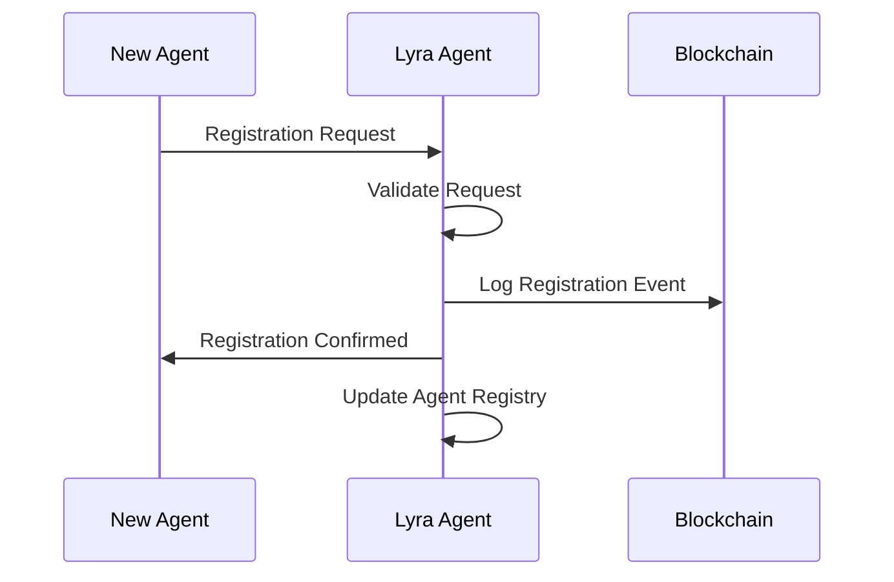
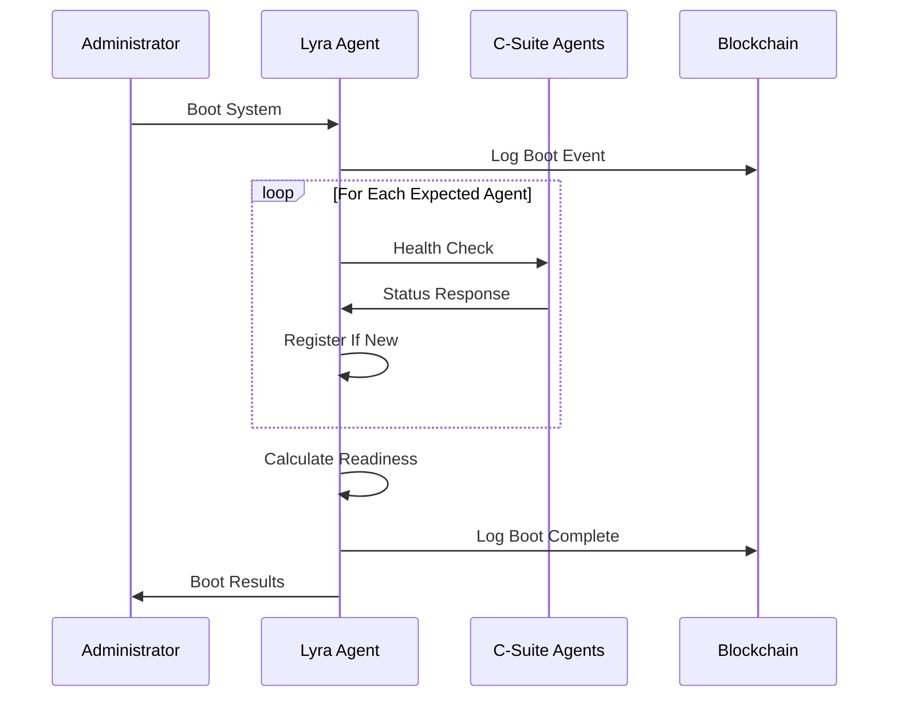
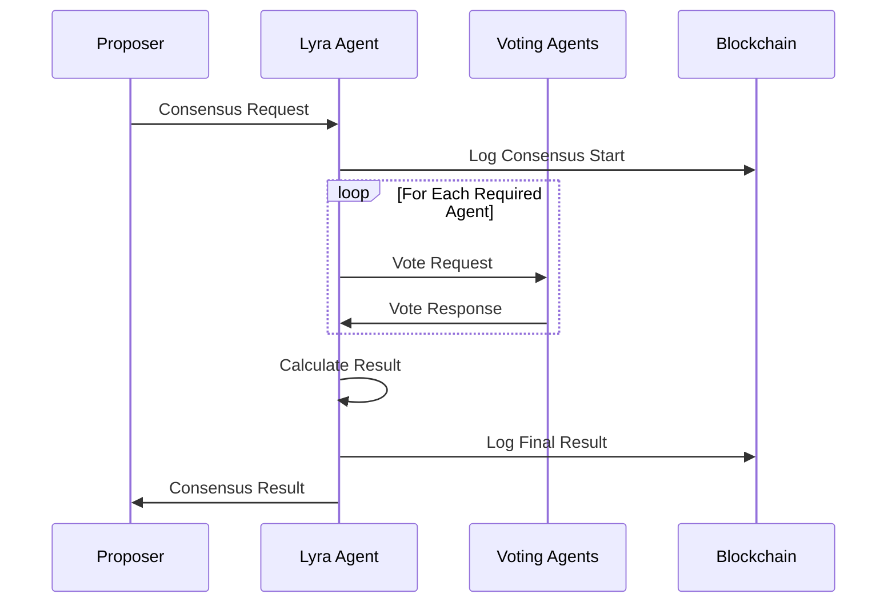

# ----------------------------------------------------------------------------
#  File:        README.md
#  Project:     Celaya Solutions (C-Suite Blockchain)
#  Created by:  Celaya Solutions, 2025
#  Author:      Christopher Celaya <chris@celayasolutions.com>
#  Description: Lyra Agent Documentation - OS/Meta-Orchestrator
#  Version:     1.0.0
#  License:     BSL (SPDX id BUSL)
#  Last Update: (May 2025)
# ----------------------------------------------------------------------------

# 🏢 Lyra Agent - OS/Meta-Orchestrator

## Overview

**Lyra** is the supreme coordinator and meta-orchestrator of the C-Suite agent ecosystem. As the highest-privilege agent in the system, Lyra is responsible for booting, coordinating, and maintaining all other agents in the enterprise blockchain environment.

## 🎯 Primary Functions

### 1. **System Orchestration**
- Boot and coordinate all C-Suite agents
- Manage agent registration and lifecycle
- Monitor system-wide health and performance
- Coordinate multi-agent consensus decisions

### 2. **Authority Management**
- Delegate temporary privileges to other agents
- Manage super-agent permissions
- Enforce role-based access control
- Track and audit authority usage

### 3. **Consensus Coordination**
- Facilitate multi-agent voting and consensus
- Manage proposal lifecycle and deadlines
- Calculate participation and consensus rates
- Track consensus success metrics

### 4. **Health Monitoring**
- Monitor all registered agent health
- Generate system health reports
- Provide operational recommendations
- Track critical system events

## 🔧 Core Tools

### **Agent Management**
- `lyra_register_agent()` - Register new C-Suite agents
- `lyra_boot_system()` - Boot and coordinate agent startup
- `lyra_monitor_system_health()` - Check system and agent health

### **Consensus Orchestration**
- `lyra_coordinate_consensus()` - Manage multi-agent consensus
- `lyra_delegate_authority()` - Delegate temporary privileges

### **Inherited Core Tools**
- All minimum required tools from `CoreTools`
- Blockchain logging and verification
- Memory management and recall
- Inter-agent communication
- Cryptographic signing

## 🚀 Quick Start

### 1. Basic Usage

```python
from agents.lyra.lyra_agent_enhanced import LyraAgentEnhanced

config = {
    'max_agents': 13,
    'consensus_timeout': 300
}

lyra = LyraAgentEnhanced(config)

# Boot the system
boot_result = await lyra.lyra_boot_system()
print(f"System Ready: {boot_result['system_ready']}")

# Check system health
health = await lyra.lyra_monitor_system_health()
print(f"System Status: {health['system_health']['overall_status']}")
```

### 2. CLI Interface

```bash
cd tool_calling/agents/lyra
python lyra_cli.py
```

Available commands:
- `boot` - Boot the C-Suite agent system
- `register` - Register a new agent
- `consensus` - Initiate multi-agent consensus
- `health` - Check system health
- `delegate` - Delegate authority
- `status` - Show system status
- `tools` - List available tools

### 3. Testing

```bash
cd tool_calling/agents/lyra
python test_lyra.py
```

## 🏗️ Architecture

### **Agent Registration Flow**


### **System Boot Sequence**


### **Consensus Coordination**


## 📊 System Health Metrics

### **Health Status Levels**
- **Healthy** (80-100%): All systems operational
- **Degraded** (50-79%): Some issues, reduced capacity
- **Critical** (<50%): Major issues, immediate attention required

### **Consensus Metrics**
- **Participation Rate**: Percentage of agents responding to votes
- **Consensus Rate**: Percentage of successful agreements
- **Success Rate**: Historical consensus success tracking

### **Event Tracking**
- **System Events**: Boot, shutdown, upgrades
- **Agent Events**: Registration, status changes
- **Critical Alerts**: Security issues, failures

## 🔐 Security Features

### **Super Agent Privileges**
- System-wide coordination authority
- Agent registration and management
- Emergency system controls
- Authority delegation capabilities

### **Authority Delegation**
```python
# Delegate temporary privileges
result = await lyra.lyra_delegate_authority(
    target_agent="echo_agent",
    privileges=["audit_access", "report_generation"],
    duration_minutes=120
)
```

### **Consensus Security**
- Minimum participation thresholds
- Vote timeout mechanisms
- Cryptographic vote verification
- Audit trail maintenance

## 🎛️ Configuration

### **lyra_config.json**
```json
{
  "agent_id": "lyra_agent",
  "role": "OS/Meta-Orchestrator",
  "max_agents": 13,
  "consensus_timeout": 300,
  "is_super_agent": true,
  "system_boot_timeout": 60,
  "health_check_interval": 30,
  "delegation_default_duration": 60
}
```

### **Key Parameters**
- `max_agents`: Maximum number of registered agents
- `consensus_timeout`: Default consensus voting timeout (seconds)
- `system_boot_timeout`: Maximum time for system boot (seconds)
- `health_check_interval`: Health monitoring frequency (seconds)

## 🤝 Inter-Agent Communication

### **Expected C-Suite Agents**
- **beacon_agent**: Knowledge & Insight Agent
- **theory_agent**: Fact-Checking & Validation Agent
- **core_agent**: Main Processor & Insight Engine
- **echo_agent**: Insight Relay & Auditing Agent
- **verdict_agent**: Legal & Compliance Agent
- **volt_agent**: Hardware & Electrical Diagnostics Agent
- **vitals_agent**: Medical & Health Diagnostics Agent
- **sentinel_agent**: Security & Surveillance Agent
- **lens_agent**: Visual Analysis & Scanner Agent
- **arc_agent**: ECU & Vehicle Controller Agent
- **otto_agent**: Autonomous Vehicle & Robotics Agent
- **luma_agent**: Smart Home & Environmental Agent

### **Communication Patterns**
```python
# Boot coordination
response = await lyra.tools_call_agent(
    "beacon_agent", 
    "System boot coordination - please report status and capabilities"
)

# Health check
response = await lyra.tools_call_agent(
    "theory_agent",
    "Health check - please report current status"
)

# Consensus voting
response = await lyra.tools_call_agent(
    "core_agent",
    f"CONSENSUS REQUEST: {consensus_id}\nTopic: {topic}\nProposal: {proposal}"
)
```

## 📈 Performance Monitoring

### **Key Metrics**
- System readiness percentage
- Agent response times
- Consensus completion rates
- Health check success rates
- Event processing times

### **Operational Recommendations**
- Monitor health percentage trends
- Investigate unhealthy agents promptly
- Archive old system events regularly
- Track consensus success patterns
- Monitor critical alert frequencies

## 🔧 Troubleshooting

### **Common Issues**

**Low System Readiness**
- Check agent network connectivity
- Verify agent configurations
- Review boot sequence logs
- Restart unresponsive agents

**Consensus Failures**
- Check agent participation rates
- Verify voting timeout settings
- Review agent communication logs
- Ensure quorum requirements are met

**Health Check Failures**
- Verify agent network status
- Check agent resource usage
- Review system event logs
- Monitor critical alerts

### **Diagnostic Commands**
```bash
# CLI health check
lyra> health

# CLI system status
lyra> status

# CLI boot sequence
lyra> boot

# CLI consensus test
lyra> consensus
```

## 🚀 Integration with C-Suite Ecosystem

### **Blockchain Integration**
- All operations logged to blockchain
- Cryptographic verification of events
- Immutable audit trail maintenance
- Multi-signature consensus records

### **Dashboard Integration**
- Real-time system status monitoring
- Agent health visualization
- Consensus tracking and analytics
- Event timeline and alerts

### **Enterprise Features**
- Role-based access control
- Authority delegation mechanisms
- Compliance audit trails
- Performance metrics reporting

---

🏢 **Lyra Agent - Supreme Coordinator of Enterprise AI Intelligence**

*Ensuring seamless orchestration and coordination across the entire C-Suite agent ecosystem with enterprise-grade reliability and security.* 