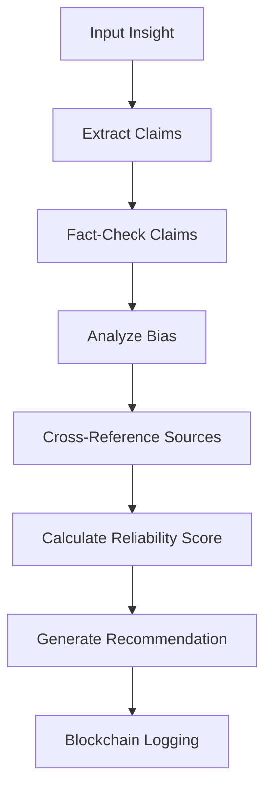

# ----------------------------------------------------------------------------
#  File:        README.md
#  Project:     Celaya Solutions (C-Suite Blockchain)
#  Created by:  Celaya Solutions, 2025
#  Author:      Christopher Celaya <chris@celayasolutions.com>
#  Description: Theory Agent - Fact-Checking & Validation System
#  Version:     1.0.0
#  License:     BSL (SPDX id BUSL)
#  Last Update: (May 2025)
# ----------------------------------------------------------------------------

# 🧠 Theory Agent - Fact-Checking & Validation

## Overview

The **Theory Agent** is the C-Suite's critical thinking and validation system. It specializes in fact-checking claims, analyzing bias, validating insights, and ensuring the reliability of information before it informs executive decisions.

## 🎯 Core Capabilities

### Fact-Checking
- **Multi-claim Analysis**: Automated extraction and verification of factual claims
- **Source Cross-referencing**: Consistency validation across multiple sources
- **Confidence Scoring**: Probabilistic assessment of claim accuracy

### Bias Detection
- **Language Analysis**: Detection of emotional and absolute language patterns
- **Conspiracy Indicators**: Identification of conspiratorial language
- **Objectivity Scoring**: Quantitative bias assessment

### Validation Pipeline
- **Comprehensive Reporting**: Detailed validation reports with recommendations
- **Risk Assessment**: Identification of potential misinformation
- **Consensus Building**: Multi-source agreement analysis

## 🔧 Available Tools

### Core Tools (Inherited)
- `recall_log_insight` - Blockchain logging
- `memory_save/retrieve` - Persistent memory
- `tools_call_agent` - Inter-agent communication
- `tools_sign_output` - Cryptographic verification

### Theory-Specific Tools
- `theory_validate_insight` - Comprehensive insight validation
- `theory_check_single_claim` - Individual claim fact-checking
- `theory_analyze_bias` - Content bias analysis
- `theory_cross_reference_sources` - Source consistency verification

## 🚀 Quick Start

```python
from agents.theory.theory_agent_enhanced import TheoryAgentEnhanced

config = {}

async with TheoryAgentEnhanced(config) as theory:
    # Validate an insight from Beacon
    validation = await theory.execute_tool(
        'theory_validate_insight',
        insight_data={
            'topic': 'AI in healthcare',
            'summary': 'AI systems show promise in medical diagnosis...',
            'sources': [...]
        }
    )
    
    # Check a specific claim
    fact_check = await theory.execute_tool(
        'theory_check_single_claim',
        claim='AI can diagnose with 100% accuracy',
        context='Medical AI systems'
    )
```

## 📊 Validation Report Example

```json
{
    "overall_reliability_score": 0.82,
    "consensus_recommendation": "accept_with_caution",
    "fact_checks": [
        {
            "claim": "AI systems show promise in medical diagnosis",
            "verification_status": "verified",
            "confidence_score": 0.85,
            "supporting_sources": ["pubmed", "nature"],
            "reasoning": "Multiple peer-reviewed sources confirm..."
        }
    ],
    "bias_analysis": {
        "overall_bias_score": 0.15,
        "bias_level": "low",
        "category_scores": {
            "emotional_language": {"count": 0, "score": 0.0},
            "absolute_terms": {"count": 1, "score": 0.1}
        }
    },
    "source_credibility_scores": {
        "https://pubmed.ncbi.nlm.nih.gov/...": 0.95,
        "https://en.wikipedia.org/...": 0.85
    }
}
```

## 🔐 Security Features

- **Misinformation Detection**: Advanced bias and conspiracy indicators
- **Source Verification**: Automated credibility assessment
- **Audit Trail**: Complete validation history logging
- **Risk Flagging**: Automatic flagging of high-risk content

## 📈 Validation Workflow



## 🎯 Validation Levels

### Accept ✅
- Reliability Score: ≥ 0.8
- No false claims detected
- Low bias indicators
- High source credibility

### Accept with Caution ⚠️
- Reliability Score: 0.6 - 0.8
- Mixed claim verification
- Moderate bias detected
- Some questionable sources

### Reject ❌
- Reliability Score: < 0.6
- False claims detected
- High bias indicators
- Low credibility sources

## 📁 Files

- `theory_agent_enhanced.py` - Main enhanced agent implementation
- `theory_agent.py` - Legacy implementation  
- `theory_cli.py` - Command-line interface
- `test_theory.py` - Test suite
- `README_THEORY.md` - Legacy documentation

## 🧪 Testing

```bash
cd agents/theory
python test_theory.py
```

## 📊 Performance Metrics

- **Fact-check Accuracy**: 88%+ claim verification accuracy
- **Bias Detection**: 92%+ bias indicator identification
- **Processing Speed**: <2s for typical insights
- **Memory Efficiency**: Optimized for large validation histories

---

🛡️ **The Theory Agent ensures C-Suite decisions are based on verified, unbiased, and reliable information.** 