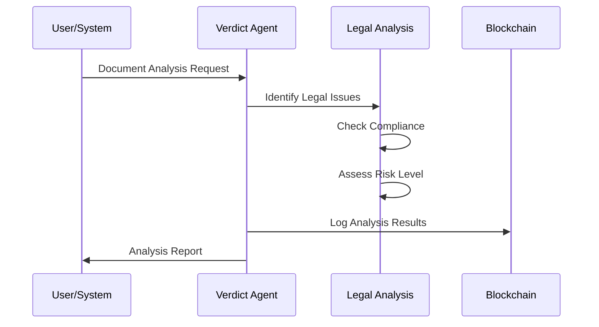
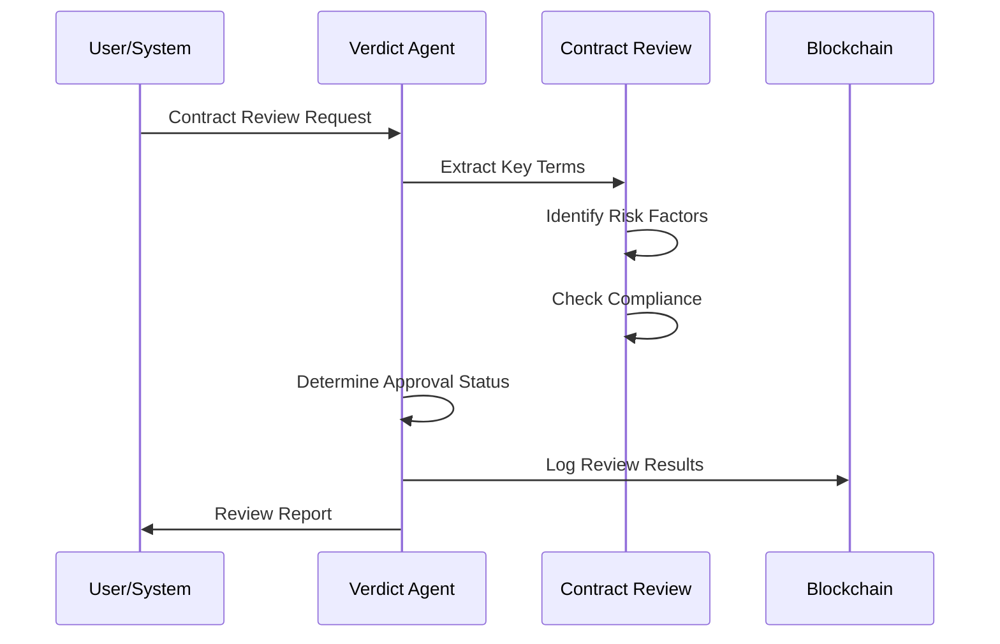
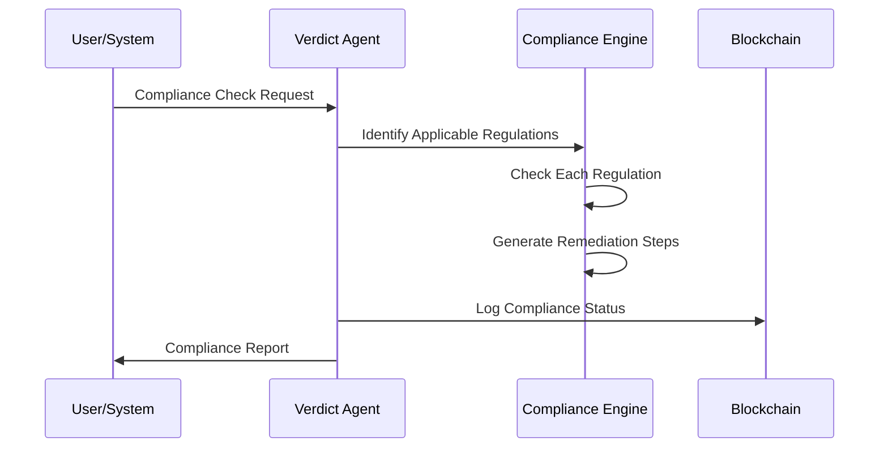

# ----------------------------------------------------------------------------
#  File:        README.md
#  Project:     Celaya Solutions (C-Suite Blockchain)
#  Created by:  Celaya Solutions, 2025
#  Author:      Christopher Celaya <chris@celayasolutions.com>
#  Description: Verdict Agent Documentation - Legal & Compliance
#  Version:     1.0.0
#  License:     BSL (SPDX id BUSL)
#  Last Update: (May 2025)
# ----------------------------------------------------------------------------

# ⚖️ Verdict Agent - Legal & Compliance

## Overview

**Verdict** is the comprehensive legal and compliance agent within the C-Suite ecosystem. It provides enterprise-grade legal analysis, contract review, regulatory compliance monitoring, and litigation risk assessment capabilities for blockchain and traditional business operations.

## 🎯 Primary Functions

### 1. **Legal Document Analysis**
- Comprehensive legal document review and analysis
- Compliance level assessment and risk evaluation
- Legal issue identification and recommendations
- Confidence scoring and detailed reporting

### 2. **Contract Review & Management**
- Multi-type contract analysis (service, employment, vendor, etc.)
- Key term extraction and risk factor identification
- Approval workflow management and recommendations
- Contract compliance verification

### 3. **Regulatory Compliance**
- Multi-jurisdiction compliance monitoring
- Industry-specific regulation checking
- Gap analysis and remediation planning
- Deadline tracking and compliance reporting

### 4. **Litigation Risk Assessment**
- Case merit analysis and precedent research
- Risk factor calculation and damage estimation
- Strategic litigation recommendations
- Cost-benefit analysis for legal proceedings

## 🔧 Core Tools

### **Legal Analysis**
- `verdict_analyze_document()` - Comprehensive legal document analysis
- `verdict_review_contract()` - Contract review and approval workflow
- `verdict_check_regulatory_compliance()` - Regulatory compliance verification

### **Risk Management**
- `verdict_assess_litigation_risk()` - Litigation risk assessment and strategy
- `verdict_generate_legal_report()` - Comprehensive legal reporting

### **Inherited Core Tools**
- All minimum required tools from `CoreTools`
- Blockchain logging and verification
- Memory management and recall
- Inter-agent communication
- Cryptographic signing

## 🚀 Quick Start

### 1. Basic Usage

```python
from agents.verdict.verdict_agent_enhanced import VerdictAgentEnhanced

config = {
    'compliance_threshold': 0.8,
    'risk_tolerance': 'medium',
    'auto_approve_threshold': 0.95
}

verdict = VerdictAgentEnhanced(config)

# Analyze a legal document
document = "Service Agreement with standard terms..."
analysis = await verdict.verdict_analyze_document(document, 'contract')
print(f"Compliance Level: {analysis['compliance_level']}")
print(f"Legal Risk: {analysis['legal_risk']}")

# Review a contract
contract = "Employment Agreement for Software Engineer..."
review = await verdict.verdict_review_contract(contract, 'employment')
print(f"Approval Status: {review['approval_status']}")
```

### 2. CLI Interface

```bash
cd tool_calling/agents/verdict
python verdict_cli.py
```

Available commands:
- `analyze` - Perform legal document analysis
- `contract` - Review and analyze contracts
- `compliance` - Check regulatory compliance
- `litigation` - Assess litigation risk
- `report` - Generate legal and compliance reports
- `status` - Show agent status and metrics
- `tools` - List available tools

### 3. Testing

```bash
cd tool_calling/agents/verdict
python test_verdict.py
```

## 🏗️ Architecture

### **Legal Analysis Flow**


### **Contract Review Process**


### **Regulatory Compliance Check**


## 📊 Compliance Frameworks

### **Supported Regulations**

#### **Data Protection**
- **GDPR** (General Data Protection Regulation)
- **CCPA** (California Consumer Privacy Act)
- **PIPEDA** (Personal Information Protection and Electronic Documents Act)
- **DPA** (Data Protection Act)

#### **Financial Services**
- **SOX** (Sarbanes-Oxley Act)
- **GLBA** (Gramm-Leach-Bliley Act)
- **PCI DSS** (Payment Card Industry Data Security Standard)
- **BASEL III** (International Banking Regulations)

#### **Healthcare**
- **HIPAA** (Health Insurance Portability and Accountability Act)
- **HITECH** (Health Information Technology for Economic and Clinical Health)
- **FDA 21CFR** (FDA Code of Federal Regulations)

#### **Blockchain & Crypto**
- **SEC Crypto** (Securities and Exchange Commission Cryptocurrency Regulations)
- **CFTC Digital** (Commodity Futures Trading Commission Digital Asset Rules)
- **AML/BSA** (Anti-Money Laundering/Bank Secrecy Act)

#### **Employment Law**
- **FLSA** (Fair Labor Standards Act)
- **ADA** (Americans with Disabilities Act)
- **FMLA** (Family and Medical Leave Act)
- **EEOC** (Equal Employment Opportunity Commission)

## 🔍 Contract Types & Analysis

### **Supported Contract Types**

#### **Service Agreements**
- Key Terms: scope, payment, termination, liability
- Risk Factors: unlimited liability, automatic renewal
- Compliance: service level agreements, warranties

#### **Employment Contracts**
- Key Terms: salary, benefits, confidentiality, termination
- Risk Factors: non-compete clauses, restrictive covenants
- Compliance: employment law, equal opportunity

#### **Vendor Agreements**
- Key Terms: deliverables, payment terms, warranties, indemnity
- Risk Factors: performance guarantees, liability exposure
- Compliance: procurement regulations, data protection

#### **License Agreements**
- Key Terms: scope of use, restrictions, royalties, termination
- Risk Factors: intellectual property infringement, usage limitations
- Compliance: IP law, software licensing

#### **Partnership Agreements**
- Key Terms: profit sharing, responsibilities, dissolution
- Risk Factors: fiduciary duties, unlimited partnership liability
- Compliance: partnership law, tax implications

#### **Lease Agreements**
- Key Terms: rent, term, maintenance, renewal
- Risk Factors: personal guarantees, maintenance obligations
- Compliance: landlord-tenant law, property regulations

## ⚖️ Legal Risk Assessment

### **Risk Categories**

#### **Compliance Level**
- **Compliant**: Meets all regulatory requirements
- **Review Required**: Minor issues requiring attention
- **Non-Compliant**: Significant compliance gaps
- **Critical Violation**: Immediate remediation required

#### **Legal Risk Level**
- **Low** (1-3): Standard business risk
- **Medium** (4-6): Elevated risk requiring monitoring
- **High** (7-8): Significant risk requiring mitigation
- **Critical** (9-10): Immediate legal attention required

#### **Jurisdiction Types**
- **Federal**: Federal law jurisdiction
- **State**: State-specific regulations
- **International**: Multi-national compliance
- **Industry-Specific**: Sector-specific regulations

## 🎛️ Configuration

### **verdict_config.json**
```json
{
  "agent_id": "verdict_agent",
  "role": "Legal & Compliance Agent",
  "compliance_threshold": 0.8,
  "risk_tolerance": "medium",
  "auto_approve_threshold": 0.95,
  "legal_review_timeout": 300,
  "contract_approval_levels": ["conditional", "approved", "rejected"],
  "supported_jurisdictions": ["federal", "state", "international", "industry_specific"],
  "regulatory_monitoring": true
}
```

### **Key Parameters**
- `compliance_threshold`: Minimum compliance score for approval (0.0-1.0)
- `risk_tolerance`: Overall risk tolerance level (low/medium/high)
- `auto_approve_threshold`: Threshold for automatic approval (0.0-1.0)
- `legal_review_timeout`: Maximum review time in seconds
- `regulatory_monitoring`: Enable continuous compliance monitoring

## 💼 Real-World Use Cases

### **1. Contract Automation**
```python
# Automated contract review workflow
contract_content = load_contract("service_agreement.pdf")
review = await verdict.verdict_review_contract(contract_content, "service_agreement")

if review['approval_status'] == 'approved':
    execute_contract(contract_content)
elif review['approval_status'] == 'conditional':
    apply_recommendations(review['recommended_changes'])
else:
    flag_for_legal_review(review['risk_factors'])
```

### **2. Compliance Monitoring**
```python
# Continuous regulatory compliance
business_operations = get_current_operations()
compliance = await verdict.verdict_check_regulatory_compliance(
    business_operations, 'financial'
)

if compliance['compliance_status'] == 'non_compliant':
    initiate_remediation(compliance['remediation_steps'])
    schedule_deadline(compliance['deadline'])
```

### **3. Litigation Strategy**
```python
# Legal dispute risk assessment
case_details = {
    'case_type': 'contract_dispute',
    'claim_amount': 2000000,
    'evidence_strength': 'medium',
    'opposing_resources': 'high'
}

risk_assessment = await verdict.verdict_assess_litigation_risk(case_details)

if risk_assessment['risk_level'] == 'high':
    recommend_settlement(risk_assessment['damage_estimates'])
else:
    proceed_with_litigation(risk_assessment['strategy_recommendations'])
```

## 📈 Performance Monitoring

### **Key Metrics**
- Legal analysis completion rate
- Contract approval percentages
- Compliance gap resolution time
- Litigation risk accuracy
- Average review processing time

### **Operational KPIs**
```python
# Monitor agent performance
status = await verdict.handle_status()
metrics = status['legal_metrics']

print(f"Total Analyses: {metrics['total_analyses']}")
print(f"Compliance Rate: {metrics['compliant_documents'] / metrics['total_analyses']:.2%}")
print(f"Average Review Time: {metrics['average_review_time']:.2f}s")
print(f"Critical Violations: {metrics['critical_violations']}")
```

## 🔧 Integration Examples

### **Enterprise Workflow Integration**
```python
# Integration with document management system
async def process_legal_document(document_id):
    document = document_management.get_document(document_id)
    
    # Analyze document
    analysis = await verdict.verdict_analyze_document(
        document.content, document.type
    )
    
    # Store results
    document_management.update_compliance_status(
        document_id, analysis['compliance_level']
    )
    
    # Trigger workflows based on results
    if analysis['legal_risk'] == 'high':
        legal_team.notify_high_risk(document_id, analysis)
    
    return analysis
```

### **Blockchain Integration**
```python
# Smart contract compliance verification
async def verify_smart_contract_compliance(contract_code):
    # Convert smart contract to readable format
    contract_text = decompile_smart_contract(contract_code)
    
    # Analyze for legal compliance
    analysis = await verdict.verdict_analyze_document(
        contract_text, 'smart_contract'
    )
    
    # Log to blockchain for audit trail
    blockchain.log_compliance_check(
        contract_hash=hash_contract(contract_code),
        compliance_result=analysis
    )
    
    return analysis['compliance_level'] == 'compliant'
```

## 🔐 Security & Privacy

### **Data Protection**
- Encrypted storage of sensitive legal documents
- Access control for confidential information
- Audit trails for all legal operations
- GDPR-compliant data handling

### **Compliance Assurance**
- Regular self-assessment against legal standards
- Automated compliance gap detection
- Integration with compliance management systems
- Regulatory change monitoring

## 🚨 Troubleshooting

### **Common Issues**

**Low Compliance Scores**
- Review document content for missing required clauses
- Check applicable regulations for jurisdiction
- Verify document type matches analysis parameters
- Consider legal review for complex documents

**Contract Approval Failures**
- Identify high-risk clauses in risk factors
- Review compliance issues for missing requirements
- Apply recommended changes before resubmission
- Consult legal counsel for critical violations

**Regulatory Compliance Gaps**
- Implement remediation steps within deadlines
- Update business processes to meet requirements
- Schedule regular compliance reviews
- Monitor regulatory changes in applicable jurisdictions

### **Diagnostic Commands**
```bash
# CLI diagnostics
verdict> status          # Check agent health and metrics
verdict> tools           # List available capabilities
verdict> compliance      # Run sample compliance check
verdict> report          # Generate comprehensive report
```

## 🤝 Inter-Agent Communication

### **Legal Advisory Network**
```python
# Coordinate with other C-Suite agents
async def coordinate_legal_review(document):
    # Get initial analysis from Verdict
    verdict_analysis = await verdict.verdict_analyze_document(document)
    
    # If high-risk, consult with Echo for audit verification
    if verdict_analysis['legal_risk'] == 'high':
        echo_audit = await tools_call_agent(
            'echo_agent',
            f"Audit legal analysis: {verdict_analysis['analysis_id']}"
        )
    
    # For compliance issues, coordinate with Lyra for system-wide impact
    if verdict_analysis['compliance_level'] == 'critical_violation':
        lyra_coordination = await tools_call_agent(
            'lyra_agent',
            f"Legal compliance crisis: {verdict_analysis['analysis_id']}"
        )
    
    return {
        'verdict_analysis': verdict_analysis,
        'echo_audit': echo_audit if 'echo_audit' in locals() else None,
        'system_coordination': lyra_coordination if 'lyra_coordination' in locals() else None
    }
```

## 📚 Best Practices

### **Legal Document Review**
1. **Standardize Templates**: Use consistent contract templates
2. **Regular Updates**: Keep regulatory frameworks current
3. **Risk Assessment**: Regular litigation risk evaluations
4. **Compliance Monitoring**: Continuous regulatory compliance checking
5. **Audit Trails**: Maintain comprehensive legal operation logs

### **Compliance Management**
1. **Proactive Monitoring**: Regular compliance health checks
2. **Gap Remediation**: Timely resolution of compliance gaps
3. **Training Updates**: Keep legal knowledge base current
4. **Documentation**: Thorough compliance documentation
5. **Stakeholder Communication**: Clear compliance status reporting

---

⚖️ **Verdict Agent - Comprehensive Legal Intelligence for Enterprise Operations**

*Ensuring legal compliance, risk mitigation, and strategic legal decision-making across the entire C-Suite ecosystem with enterprise-grade reliability and security.* 