# 🔍 Beacon - Knowledge & Insight Agent

> **"To retrieve, summarize, and publish external knowledge — with full transparency and on-chain audit logs."**

## 🚀 Overview

Beacon is the first C-Suite agent implementation, designed to demonstrate how AI agents can retrieve, verify, and permanently record knowledge insights on the blockchain. It serves as the foundation for the multi-agent C-Suite ecosystem.

### 🎯 Mission
- **Retrieve** knowledge from multiple external sources
- **Summarize** complex information into actionable insights  
- **Publish** verified insights with full transparency
- **Audit** all knowledge retrieval with immutable on-chain logs

---

## 🏗️ Architecture

```mermaid
graph TD
    User[👤 User Query] --> Beacon[🔍 Beacon Agent]
    
    Beacon --> Wikipedia[📚 Wikipedia API]
    Beacon --> PubMed[🔬 PubMed API] 
    Beacon --> Wolfram[🧮 Wolfram Alpha]
    Beacon --> News[📰 News API]
    
    Wikipedia --> Summary[📝 Summary Generation]
    PubMed --> Summary
    Wolfram --> Summary
    News --> Summary
    
    Summary --> Hash[🔒 Content Hash]
    Hash --> IPFS[📦 IPFS Storage]
    IPFS --> Signature[✍️ Agent Signature]
    
    Signature --> Recall[⛓️ Recall Pallet]
    Recall --> Blockchain[🔗 C-Suite Blockchain]
    
    Blockchain --> Event[📡 Event Log]
    Event --> Dashboard[📊 C-Suite Dashboard]
```



---

## 📦 Components

### 🔍 Core Agent (`beacon_agent.py`)
The main Beacon agent with knowledge retrieval capabilities:

- **Multi-source queries**: Wikipedia, PubMed, Wolfram Alpha, News APIs
- **Intelligent summarization**: Combines information from multiple sources
- **Content integrity**: SHA256 hashing for tamper detection
- **Agent signatures**: Cryptographic proof of insight origin

### ⛓️ Blockchain Client (`blockchain_client.py`)
Interface for submitting insights to the C-Suite blockchain:

- **Simulation mode**: Test without running blockchain node
- **Production mode**: Direct integration with Substrate blockchain
- **Recall pallet integration**: Stores consensus records on-chain
- **Event monitoring**: Tracks submission status and confirmations

### 🖥️ CLI Interface (`beacon_cli.py`)
Command-line interface for interacting with Beacon:

- **Interactive queries**: Ask Beacon about any topic
- **Batch processing**: Research multiple topics from file
- **Log management**: View and analyze insight history
- **Configuration**: Manage API keys and settings

### ⛓️ Recall Pallet (`pallets/recall/`)
Substrate pallet for storing consensus records:

- **Consensus records**: Immutable insight storage
- **Agent signatures**: Multi-agent signing support
- **Trust scoring**: Reputation-based reliability
- **Content indexing**: Hash-based content lookup

---

## 🚀 Quick Start

### 1. **Setup Environment**

```bash
cd tool_calling/

# Install Python dependencies
pip install -r requirements.txt

# Create configuration file
python beacon_cli.py ask "test" # Creates default config
```

### 2. **Configure API Keys** (Optional)

Edit `beacon_config.json`:
```json
{
  "news_api_key": "your_news_api_key_here",
  "wolfram_api_key": "your_wolfram_key_here", 
  "default_sources": ["wikipedia", "pubmed"]
}
```

### 3. **Test the Agent**

```bash
# Simple query (works without API keys)
python beacon_cli.py ask "artificial intelligence"

# Specify sources
python beacon_cli.py ask "machine learning" --sources wikipedia pubmed

# Batch research
echo -e "blockchain\nquantum computing\ndata science" > topics.txt
python beacon_cli.py batch topics.txt
```

### 4. **View Results**

```bash
# List all insight logs
python beacon_cli.py logs

# View latest insights
python beacon_cli.py show-log

# View specific date
python beacon_cli.py show-log 20250101
```

---

## 🧪 Example Usage

### Query Single Topic
```bash
$ python beacon_cli.py ask "lithium toxicity symptoms"

🔍 Beacon researching: lithium toxicity symptoms
==================================================

📋 SUMMARY:
----------
## Knowledge Summary: lithium toxicity symptoms

**Wikipedia Overview:** Lithium toxicity is a condition that occurs when there are high levels of lithium in the blood...

**Scientific Literature (3 articles found):**
1. Lithium Toxicity: Clinical Features and Management - Smith et al
2. Renal Effects of Lithium Toxicity - Johnson et al  
3. Neurological Complications of Lithium Poisoning - Brown et al

📚 SOURCES (4):
--------------
1. 🟢 [WIKIPEDIA] Lithium toxicity
   https://en.wikipedia.org/wiki/Lithium_toxicity
2. 🟢 [PUBMED] Lithium Toxicity: Clinical Features and Management
   https://pubmed.ncbi.nlm.nih.gov/12345678/
3. 🟢 [PUBMED] Renal Effects of Lithium Toxicity
   https://pubmed.ncbi.nlm.nih.gov/87654321/
4. 🟢 [PUBMED] Neurological Complications of Lithium Poisoning
   https://pubmed.ncbi.nlm.nih.gov/11223344/

💾 LOGGING INSIGHT...
✅ Insight logged!
   Hash: a7b8c9d1e2f3g4h5...
   IPFS CID: QmX7YZ8A9B1C2D3E4F5G6H7I8J9K0L1M2N3O4P5Q6R7S8T9U0V1W2X3Y4Z5
   Signature: f8e7d6c5b4a39281...
```

### Batch Processing
```bash
$ echo -e "covid treatment\nclimate change\nartificial intelligence" > research_topics.txt
$ python beacon_cli.py batch research_topics.txt

🔬 Beacon batch research: 3 topics
==================================================

[1/3] Researching: covid treatment
✅ Completed: covid treatment

[2/3] Researching: climate change  
✅ Completed: climate change

[3/3] Researching: artificial intelligence
✅ Completed: artificial intelligence

📊 BATCH COMPLETE: 3/3 successful
```

---

## 🧪 Testing

### Run Integration Tests
```bash
# Install test dependencies
pip install pytest pytest-asyncio

# Run all tests
pytest test_beacon.py -v

# Run specific test categories
pytest test_beacon.py::TestBeaconAgent -v
pytest test_beacon.py::TestBlockchainClient -v
```

### Manual Testing
```bash
# Run integration test
python test_beacon.py

# Performance test with multiple queries
python -c "
import asyncio
from test_beacon import test_beacon_performance
asyncio.run(test_beacon_performance())
"
```

### Expected Test Output
```
Running Beacon Agent Integration Test...
✅ Query completed: quantum computing
✅ Insight logged with hash: a1b2c3d4...
✅ Blockchain submission successful
✅ Content integrity verified

Running Performance Test...
Processed 5 topics in 12.34 seconds
Average time per topic: 2.47 seconds

All tests completed! ✅
```

---

## 🔧 API Integration

### Available Sources

| Source | Description | API Key Required |
|--------|-------------|------------------|
| 📚 **Wikipedia** | Factual summaries and overviews | ❌ No |
| 🔬 **PubMed** | Scientific and medical research | ❌ No |
| 🧮 **Wolfram Alpha** | Computational answers | ✅ Yes |
| 📰 **News API** | Recent news and headlines | ✅ Yes |

### API Key Setup

1. **News API**: Get free key at [newsapi.org](https://newsapi.org)
2. **Wolfram Alpha**: Get key at [developer.wolframalpha.com](https://developer.wolframalpha.com)

Add keys to `beacon_config.json`:
```json
{
  "news_api_key": "your_key_here",
  "wolfram_api_key": "your_key_here"
}
```

---

## 🗂️ File Structure

```
tool_calling/
├── beacon_agent.py          # Core Beacon agent implementation
├── beacon_cli.py            # Command-line interface
├── blockchain_client.py     # Blockchain integration
├── test_beacon.py          # Comprehensive test suite
├── requirements.txt        # Python dependencies
├── tools.md               # Original specification
├── README.md              # This file
└── insight_logs/          # Generated insight logs
    └── beacon_insights_YYYYMMDD.jsonl

../pallets/recall/         # Substrate pallet
├── Cargo.toml            # Pallet dependencies
└── src/
    └── lib.rs            # Recall pallet implementation
```

---

## 📊 Output Formats

### Insight Log Entry (JSONL)
```json
{
  "timestamp": "2025-01-15T10:30:45Z",
  "topic": "artificial intelligence",
  "summary": "## Knowledge Summary: artificial intelligence\n\n**Wikipedia Overview:**...",
  "sources": [
    {
      "url": "https://en.wikipedia.org/wiki/Artificial_intelligence",
      "title": "Artificial intelligence",
      "source_type": "wikipedia",
      "reliability_score": 0.9
    }
  ],
  "agent_signature": "a1b2c3d4e5f6g7h8...",
  "ipfs_cid": "QmX1Y2Z3A4B5C6D7E8F9G0H1I2J3K4L5M6N7O8P9Q0R1S2T3U4V5W6X7Y8Z9",
  "insight_hash": "f9e8d7c6b5a4938271..."
}
```

### Blockchain Record Structure
```rust
pub struct ConsensusRecord<T: Config> {
    pub record_type: RecordType,           // SingleAgentInsight
    pub content_hash: Vec<u8>,             // SHA256 of content
    pub ipfs_cid: Vec<u8>,                // IPFS content ID
    pub summary: Vec<u8>,                 // Brief summary
    pub signatures: Vec<AgentSignature>,   // Agent signatures
    pub created_at: BlockNumber,          // Block number
    pub metadata: Option<Vec<u8>>,        // JSON metadata
    pub trust_score: u64,                // Reliability score
}
```

---

## 🚀 Next Steps

### Immediate (Phase 1)
- ✅ **Basic Knowledge Retrieval**: Wikipedia + PubMed integration
- ✅ **Local Logging**: JSONL insight logs
- ✅ **CLI Interface**: User-friendly command line
- ✅ **Testing Suite**: Comprehensive test coverage

### Short Term (Phase 2)
- 🔄 **Blockchain Integration**: Connect to live C-Suite node
- 🔄 **IPFS Storage**: Actual decentralized content storage
- 🔄 **Enhanced APIs**: More knowledge sources
- 🔄 **Real Signatures**: Cryptographic agent signing

### Medium Term (Phase 3)
- ⏳ **Multi-Agent Consensus**: Theory agent fact-checking
- ⏳ **Verdict Integration**: Legal validation of insights
- ⏳ **Trust Scoring**: Reputation-based reliability
- ⏳ **Real-time Queries**: Streaming knowledge updates

### Long Term (Phase 4)
- ⏳ **C-Suite Dashboard**: Visual insight management
- ⏳ **API Marketplace**: Third-party knowledge sources
- ⏳ **Agent Orchestration**: Automated multi-agent workflows
- ⏳ **Enterprise Integration**: Business intelligence pipelines

---

## 🤝 Contributing

### Development Workflow
1. **Fork** the repository
2. **Create** feature branch: `git checkout -b feature/beacon-enhancement`
3. **Implement** changes with tests
4. **Test** thoroughly: `pytest test_beacon.py -v`
5. **Document** changes in README
6. **Submit** pull request

### Code Standards
- **Python 3.8+** compatibility
- **Type hints** for all functions
- **Docstrings** for public methods
- **File headers** with project metadata
- **Max 350 lines** per file (as per project rules)

### Testing Requirements
- **Unit tests** for all new functions
- **Integration tests** for API changes
- **Performance tests** for optimization
- **Documentation** updates for user-facing changes

---

## 📝 License

**BSL (SPDX: BUSL)** - Business Source License

Copyright © 2025 Celaya Solutions  
Contact: chris@celayasolutions.com

---

## 🔗 Related

- 📋 **[Tools Specification](tools.md)**: Original Beacon requirements
- ⛓️ **[Recall Pallet](../pallets/recall/)**: Blockchain storage layer
- 🏛️ **[Agent Registry](../pallets/agent/)**: Agent management system
- 📊 **[C-Suite Dashboard](../c-suite-dashboard/)**: Web interface

---

**Ready to give your AI agents the tools they need! 🛠️✨** 